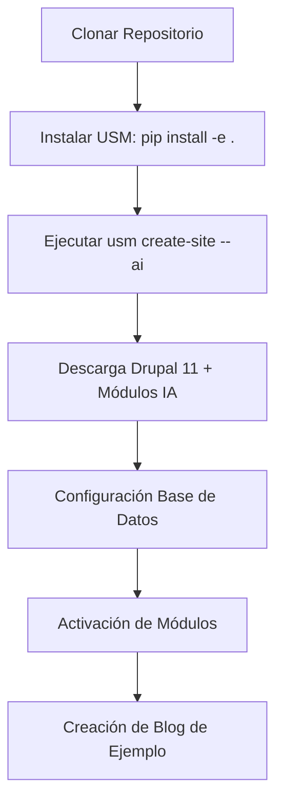
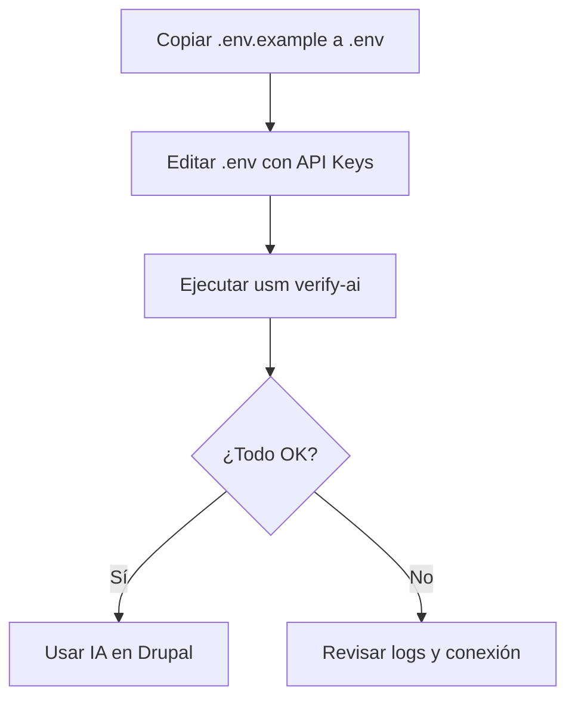

# Guía Técnica: Despliegue y Uso del Proyecto Drupal + IA en Windows

**Versión:** 1.0
**Fecha:** 2025-05-22
**Autor:** Jules (software engineer)

## 1. Introducción
Esta guía detalla el proceso para desplegar un entorno de Drupal 11 optimizado para Inteligencia Artificial en Windows, utilizando **Unified Stack Manager (USM)** y **MobaXterm**.

## 2. Requisitos Previos
- **Sistema Operativo:** Windows 10/11.
- **Entorno de Terminal:** MobaXterm (recomendado) o PowerShell como Administrador.
- **Stack Tecnológico:**
  - PHP 8.4
  - Apache 2.4 (C:\APACHE24)
  - MySQL/MariaDB (C:\mysql)
  - Composer instalado globalmente o manejado por USM.

## 3. Instalación del Entorno

### Flujo de Despliegue

```mermaid
graph TD;
    A[Clonar Repositorio] --> B[Instalar USM: pip install -e .];
    B --> C[Ejecutar usm create-site --ai];
    C --> D[Descarga Drupal 11 + Módulos IA];
    D --> E[Configuración Base de Datos];
    E --> F[Activación de Módulos];
    F --> G[Creación de Blog de Ejemplo];
```

### Paso 1: Clonar e instalar USM
```bash
git clone https://github.com/axlfc/usm.git
cd unified-stack-manager
pip install -e .
```

### Paso 2: Crear el sitio con IA
Ejecuta el siguiente comando para automatizar todo el stack de Drupal + IA:
```bash
usm create-site mi-sitio-ai.local --ai
```
Este comando realizará:
- Descarga de Drupal 11.
- Instalación de módulos como `ai`, `ai_content_suggestions`, `ai_provider_openai`, etc.
- Creación de base de datos y usuario.
- Generación de un blog de prueba con 3 artículos.

## 4. Configuración de Proveedores de IA

Para que la IA funcione, debes configurar tus API Keys.

### Flujo de Configuración de IA

```mermaid
graph TD;
    A[Copiar .env.example a .env] --> B[Editar .env con API Keys];
    B --> C[Ejecutar usm verify-ai];
    C --> D{¿Todo OK?};
    D -- Sí --> E[Usar IA en Drupal];
    D -- No --> F[Revisar logs y conexión];
```

1. Localiza el archivo `.env.example` en la raíz de tu sitio (ej: `C:\APACHE24\htdocs\mi-sitio-ai.local\.env.example`).
2. Cámbiale el nombre a `.env`.
3. Introduce tus credenciales:
   ```env
   OPENAI_API_KEY="sk-..."
   ANTHROPIC_API_KEY="sk-ant-..."
   OLLAMA_BASE_URL="http://localhost:11434"
   ```

## 5. Verificación del Entorno
USM incluye una herramienta de diagnóstico para asegurar que los ~23 módulos de IA estén activos:
```bash
usm verify-ai --site mi-sitio-ai.local
```

**Módulos verificados:**
- Core: `ai`, `key`, `ai_agents`, `ai_automators`, `ai_assistants_api`.
- Funcionalidad: `ai_chatbot`, `ai_content_suggestions`, `ai_translate`, `ai_seo`.
- Proveedores: `ai_provider_openai`, `ai_provider_ollama`, `ai_provider_anthropic`, `ai_provider_google`.

**Salida esperada:**
```text
📦 Verificando módulos de Drupal...
  ✅ Módulo 'ai'
  ✅ Módulo 'ai_content_suggestions'
  ...
📄 Validando archivo .env...
  ✅ OPENAI_API_KEY está configurado.
🌐 Probando conexiones...
  ✅ OpenAI API responde correctamente.
```

## 6. Uso de Funcionalidades de IA

### Creación de Contenido Automático (Dynamic AI Blog)
El sistema intenta generar contenido dinámico si detecta API Keys:
1. **Detección:** Busca `OPENAI_API_KEY` en el archivo `.env` del sitio.
2. **Generación:** Llama al servicio `ai_content_suggestions.suggestor` vía Drush.
3. **Fallback:** Si no hay llaves, crea 3 artículos estáticos de ejemplo.

Puedes interactuar con los módulos:
- **Sugerencias:** Usa las herramientas de `ai_content_suggestions` en el editor.
- **Traducción:** `ai_translate` para multilenguaje automático.
- **Imágenes:** `ai_media_image` para generar visuales.

### Uso de Ollama (IA Local)
Si deseas usar modelos locales:
1. Instala Ollama en Windows.
2. Ejecuta `ollama run llama3`.
3. En Drupal, configura el proveedor Ollama apuntando a `http://localhost:11434`.

## 7. Solución de Problemas

| Error | Causa Probable | Solución |
|-------|----------------|----------|
| `Drush no encontrado` | Instalación de Composer fallida | Ejecuta `composer install` en la raíz del sitio. |
| `Ollama no responde` | El servicio no está corriendo | Ejecuta `ollama serve` en una terminal. |
| `Acceso denegado DB` | Credenciales incorrectas | Revisa el archivo `web/sites/default/settings.php`. |

## 8. Validación en Windows (Para QA/Equipos)
Para validar la instalación en un entorno Windows limpio:
1. Abrir **MobaXterm** o PowerShell (Admin).
2. Clonar e instalar:
   ```powershell
   git clone https://github.com/axlfc/usm.git
   cd unified-stack-manager
   pip install -e .
   ```
3. Ejecutar creación: `usm create-site test-ia.local --ai`
4. Verificar módulos: `usm verify-ai --site test-ia.local`
5. (Opcional) Configurar `.env` y re-ejecutar `verify-ai` para probar conectividad.

## 9. Conclusión
El entorno está diseñado para ser **idempotente** y **robusto**. La unificación permite que tanto usuarios de Windows como de Linux disfruten de la misma automatización avanzada de IA para Drupal 11.
